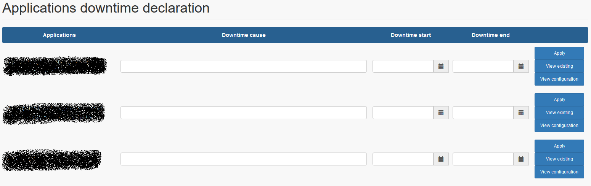
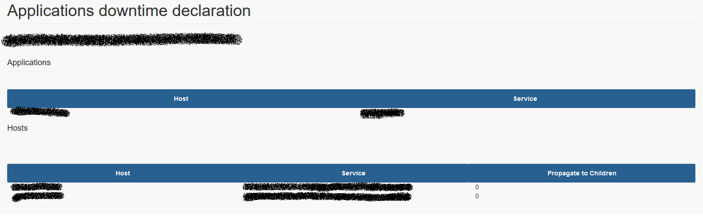

# User Interface

## Frontpage

The interface is designed to be easy to use for non technical users.

To set downtime on application (BP) into EyesOfNetwork, no complex operation, or Business Process knownledges to have.

Just set downtime cause, downtime start time and end time, then click on « Apply » button.

All configuration is masked for endless users.

## View Configurations

