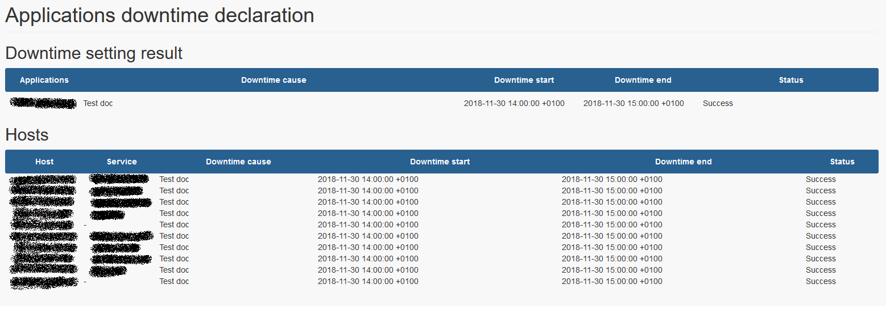
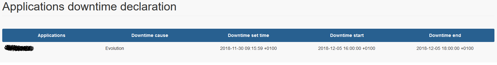

# User Interface

## Frontpage

The interface is designed to be easy to use for non technical users.

To set downtime on application (BP) into EyesOfNetwork, no complex operation, or Business Process knownledges to have.

Just set downtime cause, downtime start time and end time, then click on " Apply " button.

All configuration is masked for endless users.

## Apply Result

When you submit downtime by clicking on " Apply " button you will get a result table like this :

This board is split in two tables :
1. Application informations (Business Process)
2. Hosts and Services (unitary control points) informations

You'll see host by host and service by service applied downtime and command status code (Success / Failed).

## View Configurations

You could view application configuration by clicking on " View Configuration " button.

This interface show you hosts and service where downtime will be applied if you submit.

## View Existings

You could view existing non recurring downtime set on specific application by clicking on " View Existing " button.

This interface show you existing set downtimes into EyesOfNetwork with cause, start/end informations, and when downtime was set.

